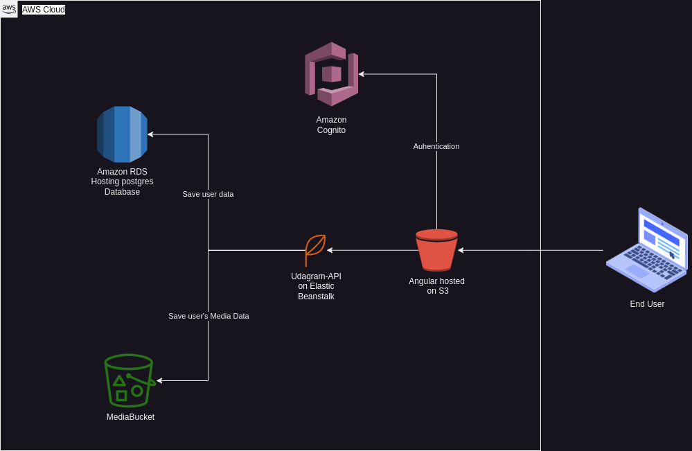

# Infrastructure
## Usage Example:

- The end user can create an account by signing-up via the frontend application where his credential will be 
checked by Amazon Cognito service and stored to the database.
- An Authenticated user can create a post (Image + caption):

## Dependencies:
The following images illustrate an overview of the Udagram application infrastructure.

- An Anglar frontend application is hosted on an AWS S3 static web page hosting service.
- A nodejs server api application is hosted on AWS elastic beanstalk service.
- The user commited credential are authenticated by AWS Cognito service.
- The user profile data are stored on AWS RDS hosting a postgres Database.
- The user uploaded pictures/media are stored on S3 Bucket.

## Components:

### Angular Front-End hosted on AWS S3:

The frontend app is hosted on AWS S3, the app can be reach through the following link:

http://randomnourdeploymentproject.s3-website-us-east-1.amazonaws.com

The status of the S3 bucket can be seen in the following image set:

- Image 1:

- Image 2:

- Image 3:
 

- Image 4:
 

- Image 5:
 

- Image 6:
 

### Web server API back-end application hosted on AWS Elastic Beanstalk:

The backend app is hosted on AWS Elastic beanstalk, the app can be reach through the following link:

http://Udagramapi-env.eba-6py7v4pb.us-east-1.elasticbeanstalk.com

The elastic beanstalk configuration file can be found under udagram/udagram-api/.elastikbeanstalk/config.yml
-  Environment name: Udagramapi-env
-  Application name: udagram_api
-  Application artifact path: ./www/Archive.zip
-  Default_platform: Node.js 14 running on 64bit Amazon Linux 2

The status of the elastic beanstalk environment can be seen in the following image set:

- Image 1:

- Image 2:
 

- Image 3:
 

- Image 4:
 

- Image 5:
 

- Image 6:
 

### Media storage hosted on AWS S3 Bucket

The backend app stores user uploaded pictures on an S3 Bucket.

The status of the S3 bucket can be seen in the following image set:

- Image 1:

- Image 2:
 

- Image 3:
 

- Image 4:
 

- Image 5:
 

### Database hosted on AWS RDS:

The backend app stores user data on a postgres database hosted on an AWS RDS.

The status of the Database can be seen in the following image set:

- Image 1:

- Image 2:
 

- Image 3:
 

- Image 4:
 

- Image 5:
 

- Image 6:
 

